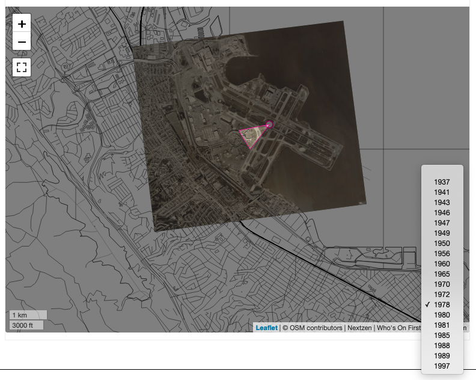

# leaflet-layers-control



Leaflet.js control for displaying one or more custom layers on a map.

## Important

Work in progress. Documentation is incomplete.

## Example

```
var lat = 37.6172;
var lon = -122.3827;
var zoom = 14;

var map = L.map("id");

map.setView([lat, lon], zoom);

var catalog = [
	{"label":"1937","year":1937,"min_zoom":12,"max_zoom":17,"source":"sfogis","url":"https://millsfield.sfomuseum.org/aerial/1937/{z}/{x}/{-y}.png"},
	{"label":"1949","year":1949,"min_zoom":11,"max_zoom":14,"source":"sfomuseum","identifier":"1997.52.084.014","url":"https://millsfield.sfomuseum.org/aerial/1949/{z}/{x}/{-y}.png"}
	// for example: https://github.com/sfomuseum/go-sfomuseum-maps/blob/master/dist/sfomuseum.maps.catalog.js
];

var layers_control = new L.Control.Layers({
    catalog: catalog,
});

map.addControl(layers_control);

layers_control.addHash();	    
```

## See also

* https://leafletjs.com/
* https://leafletjs.com/examples/layers-control/